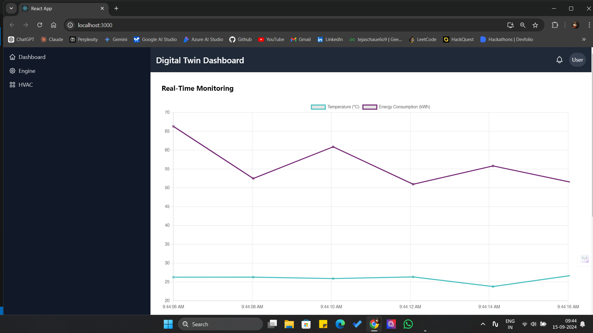
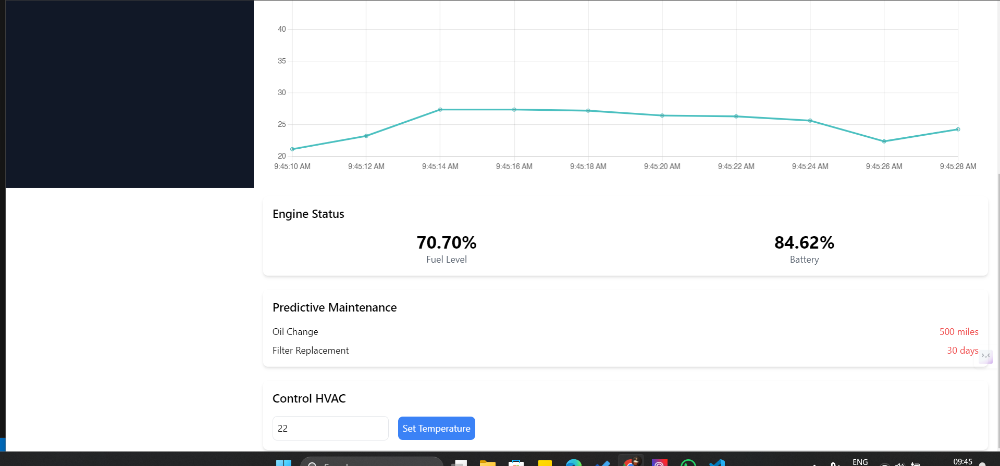

# Digital Twin Dashboard for Recreational Vehicles (RVs)

The **Digital Twin Dashboard** is a web-based application designed to monitor, simulate, and control various systems and appliances in **Recreational Vehicles (RVs)**. This project allows RV owners and service technicians to track real-time data, anticipate maintenance needs, and remotely control critical systems like HVAC.

## Table of Contents

- [Features](#features)
- [Project Structure](#project-structure)
- [Technologies Used](#technologies-used)
- [Installation](#installation)
- [Usage](#usage)
- [Screenshots](#screenshots)
- [Future Enhancements](#future-enhancements)
- [Contributing](#contributing)
- [License](#license)

## Features

1. **Real-Time Monitoring**:
   - Collect and display live data from RV systems and appliances such as the engine, HVAC, and electrical components.
   - Visualize **temperature**, **energy consumption**, and other metrics on interactive charts.

2. **Predictive Maintenance**:
   - Displays alerts and maintenance schedules for key components like oil changes and filter replacements.
   - Uses **predictive algorithms** to suggest maintenance based on real-time data and historical usage (e.g., distance traveled, days in use).

3. **Remote Control**:
   - Users can control systems like HVAC directly through the dashboard by setting parameters (e.g., temperature).

4. **Historical Data Analysis**:
   - Keep track of historical data to analyze performance trends and energy efficiency.
   - View previous maintenance history and usage patterns for optimizing system performance.

5. **User-Friendly Interface**:
   - Clean, responsive interface allowing both RV owners and service technicians to easily navigate through the dashboard.
   - Sidebar for easy navigation between system views (e.g., Engine, HVAC).

6. **Real-Time Charts and Status Panels**:
   - Displays real-time data on temperature, energy usage, fuel levels, and battery status using interactive charts.
   - Easy-to-read panels showing system status for a quick overview of critical RV components.

## Project Structure
```plaintext
Digital-Twin-Dashboard/
├── public/                         # Public assets and static files served by the app
│   ├── index.html                  # Main HTML template
│   └── favicon.ico                 # Favicon for the app
│
├── src/                            # Main source code for the frontend application
│   ├── components/                 # Reusable React components for different sections of the dashboard
│   │   ├── Controls.js             # Component for controlling RV systems like HVAC (e.g., temperature control)
│   │   ├── Dashboard.js            # Main component that displays the overall dashboard with real-time charts and system statuses
│   │   ├── Header.js               # Component for the header, containing branding and user info
│   │   ├── PredictiveMaintenance.js # Displays predictive maintenance alerts and upcoming tasks
│   │   ├── Sidebar.js              # Sidebar component for easy navigation between different sections (e.g., Engine, HVAC)
│   │   ├── SystemPanel.js          # Displays detailed information about specific RV systems (engine, HVAC, etc.)
│   │   └── websocket.js            # Handles real-time WebSocket connections for live data updates
│   │
│   ├── utils/                      # Utility functions and helpers for data processing
│   │   └── formatData.js           # Formats data for use in charts and components
│   │
│   ├── App.js                      # Main application component, the entry point for the React app
│   ├── index.js                    # Entry point for rendering the React app to the DOM
│   ├── index.css                   # Global CSS styles for the application
│   ├── App.css                     # Styles specific to the App component
│   └── tailwind.config.js          # Configuration for Tailwind CSS utility classes
│
├── .gitignore                      # Git ignore file to exclude node_modules, build files, and sensitive data
├── package.json                    # Defines project dependencies, scripts, and project metadata
├── package-lock.json               # Locked versions of dependencies for consistency across environments
├── README.md                       # Documentation file (this file)
├── LICENSE                         # MIT License file for the project
└── tailwind.config.js              # Tailwind CSS configuration file

```
## Technologies Used

- **Frontend**:
  - **React.js**: JavaScript library for building the user interface.
  - **Tailwind CSS**: Utility-first CSS framework for building a responsive and modern UI.
  - **Chart.js**: Visualization library for rendering interactive charts.
  - **WebSockets**: For real-time communication between the dashboard and backend.
  

  
- **Cloud**:
  - **AWS** or **Azure**: For cloud hosting, data storage, and server management.
  
- **DevOps**:
  - **Docker**: Containerization of the application.
  - **Kubernetes**: For orchestration and managing deployments.

## Installation

1. Clone the repository:

    ```bash
    git clone https://github.com/tejaschaudhari131/RV-DigitalTwin-Dashboard.git
    ```

2. Navigate to the project folder:

    ```bash
    cd RV-DigitalTwin-Dashboard
    ```

3. Install dependencies:

    ```bash
    npm install
    ```

4. Start the development server:

    ```bash
    npm start
    ```

5. Access the app at `http://localhost:3000`.

## Usage

1. **Navigate the Dashboard**:
   - On the left sidebar, you will see navigation options such as **Dashboard**, **Engine**, and **HVAC**.
   
2. **View Real-Time Data**:
   - The main dashboard displays live data for temperature, energy consumption, engine fuel level, and battery percentage.

3. **Predictive Maintenance Alerts**:
   - In the predictive maintenance section, check alerts for oil changes, filter replacements, and other scheduled maintenance based on real-time data.

4. **Control HVAC**:
   - Set the temperature of the HVAC system by inputting your desired value and clicking **Set Temperature**.

## Screenshots


*Main dashboard view showing real-time monitoring charts and system status.*


*Predictive maintenance section showing alerts and upcoming maintenance tasks.*

## Future Enhancements

- **Data Analytics**: Implement advanced analytics to generate insights based on historical data trends.
- **Mobile App**: Create a mobile version of the dashboard for easier access on the go.
- **Expanded Predictive Models**: Enhance the predictive maintenance algorithms to support more RV systems and appliances.
- **AI Integration**: Use AI models to optimize energy consumption and system performance in real-time.

## Contributing

Contributions are welcome! If you want to contribute to this project, please follow these steps:

1. Fork the repository.
2. Create a new branch (`git checkout -b feature-branch`).
3. Make your changes and commit them (`git commit -m 'Add some feature'`).
4. Push to the branch (`git push origin feature-branch`).
5. Open a pull request.

Please make sure to follow the [code of conduct](./CODE_OF_CONDUCT.md) when contributing.

## License

This project is licensed under the MIT License - see the [LICENSE](./LICENSE) file for details.

